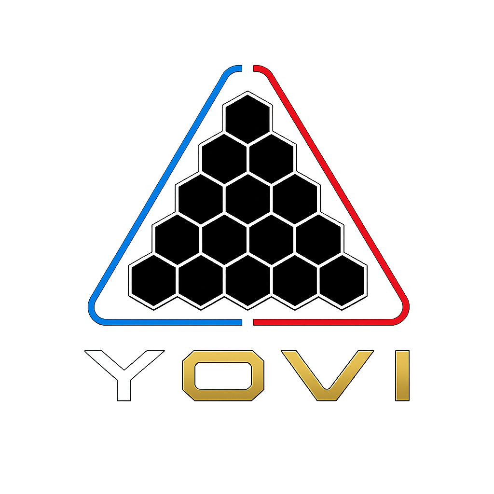

# Yovi_es5c - Game Y at UniOvi



[](https://github.com/arquisoft/yovi_es5c/actions/workflows/release-deploy.yml)
[](https://sonarcloud.io/summary/new_code?id=Arquisoft_yovi_es5c)
[](https://sonarcloud.io/summary/new_code?id=Arquisoft_yovi_es5c)

Application url: http://4.233.210.164 <br>
Documentation url: https://arquisoft.github.io/yovi_es5c/

This project is a template with some basic functionality for the ASW labs.

## Contributors:

| Contributor | Profile |
| ------------- | ------------- |
| Rodríguez Fuertes, Claudia  | <a href="https://github.com/claudiaRFS"></a>  |
| Martínez de Zuvillaga, José   | <a href="https://github.com/josemzuvi"></a>  |
| Trelles Riestra, Mario   | <a href="https://github.com/uo294254"></a>  |
| González Pérez, Daniel  | <a href="https://github.com/danigpt"></a>  |
| Arias Guerrero, Miguel | <a href="https://github.com/uo288285"></a>  |

## Project Structure

The project is divided into three main components, each in its own directory:

- `gatewayservice/`: A frontend gateway service that serves as the main entry point of the application.
- `webapp/`: A frontend application built with React, Vite, and TypeScript.
- `users/`: A backend service for managing users, built with Node.js and Express.
- `gamey/`: A Rust game engine and bot service.
- `docs/`: Architecture documentation sources following Arc42 template

Each component has its own `package.json` file with the necessary scripts to run and test the application.

## Basic Features

- **User Registration**: The web application provides a simple form to register new users.
- **User Service**: The user service receives the registration request, simulates some processing, and returns a welcome message.
- **GameY**: A basic Game engine which only chooses a random piece.

## Components

### GatewayService

It acts as the entry point for users, providing the interface to interact with backend services such as the users service.

- `src/App.tsx` The main component of the application, responsible for routing and overall layout.
- `package.json`: Contains scripts to run, build, and preview the application.
- `Dockerfile`: Defines the Docker image for the user service.

### Webapp

The `webapp` is a single-page application (SPA) created with [Vite](https://vitejs.dev/) and [React](https://reactjs.org/).

- `src/App.tsx`: The main component of the application.
- `src/RegisterForm.tsx`: The component that renders the user registration form.
- `package.json`: Contains scripts to run, build, and test the webapp.
- `vite.config.ts`: Configuration file for Vite.
- `Dockerfile`: Defines the Docker image for the webapp.

### Users Service

The `users` service is a simple REST API built with [Node.js](https://nodejs.org/) and [Express](https://expressjs.com/).

- `users-service.js`: The main file for the user service. It defines an endpoint `/createuser` to handle user creation.
- `package.json`: Contains scripts to start the service.
- `Dockerfile`: Defines the Docker image for the user service.

### Gamey

The `gamey` component is a Rust-based game engine with bot support, built with [Rust](https://www.rust-lang.org/) and [Cargo](https://doc.rust-lang.org/cargo/).

- `src/main.rs`: Entry point for the application.
- `src/lib.rs`: Library exports for the gamey engine.
- `src/bot/`: Bot implementation and registry.
- `src/core/`: Core game logic including actions, coordinates, game state, and player management.
- `src/notation/`: Game notation support (YEN, YGN).
- `src/web/`: Web interface components.
- `Cargo.toml`: Project manifest with dependencies and metadata.
- `Dockerfile`: Defines the Docker image for the gamey service.

## Running the Project

You can run this project using Docker (recommended) or locally without Docker.

### With Docker

This is the easiest way to get the project running. You need to have [Docker](https://www.docker.com/) and [Docker Compose](https://docs.docker.com/compose/) installed.

1. **Build and run the containers:**
    From the root directory of the project, run:

```bash
docker-compose up --build
```

This command will build the Docker images for both the `webapp` and `users` services and start them.

2.**Access the application:**
- Web application: [http://localhost](http://localhost)
- Gateway service API: [http://localhost:8000](http://localhost:8000)
- User service API: [http://localhost:3000](http://localhost:3000)
- Gamey API: [http://localhost:4000](http://localhost:4000)

### Without Docker

To run the project locally without Docker, you will need to run each component in a separate terminal and a MongoDB running on port 27017 (MongoDB default port).

#### Prerequisites

* [Node.js](https://nodejs.org/) and npm installed.
* [Docker](https://www.docker.com/) available if you run the end-to-end tests locally.
* A `JWT_SECRET` value configured in the environment for local login flows.
* On Windows, if `gamey` fails with `dlltool.exe: program not found`, use the MSVC Rust toolchain or install the GNU binutils that provide `dlltool.exe`.
* An instance of MongoDB running on port 27017.

#### 1. Running the User Service

Navigate to the `users` directory:

```bash
cd users
```

Install dependencies:

```bash
npm install
```

Run the service:

```bash
npm start
```

The user service will be available at `http://localhost:3000`.

#### 2. Running the Web Application

Navigate to the `webapp` directory:

```bash
cd webapp
```

Install dependencies:

```bash
npm install
```

Run the application:

```bash
npm run dev
```

The web application will be available at `http://localhost:5173`.

#### 3. Running the GameY application

At this moment the GameY application is not needed but once it is needed you should also start it from the command line.

## Available Scripts

Each component has its own set of scripts defined in its `package.json`. Here are some of the most important ones:

### Webapp (`webapp/package.json`)

- `npm run dev`: Starts the development server for the webapp.
- `npm test`: Runs the unit tests.
- `npm run test:e2e:services`: Starts MongoDB and `gamey` with Docker Compose for end-to-end tests.
- `npm run test:e2e`: Starts MongoDB and `gamey` with Docker Compose, starts the app services, and runs the end-to-end tests.
- `npm run test:e2e:run`: Runs only the Cucumber end-to-end tests against already running services.
- `npm run start:all`: A convenience script to start the `webapp`, `users`, `gatewayservice`, and `gamey` services concurrently.

### Gateway (`gatewayservice/package.json`)

- `npm start`: Starts the gateway service.
- `npm test`: Runs the tests for the service.

### Users (`users/package.json`)

- `npm start`: Starts the user service.
- `npm test`: Runs the tests for the service.

### Gamey (`gamey/Cargo.toml`)

- `cargo build`: Builds the gamey application.
- `cargo test`: Runs the unit tests.
- `cargo run`: Runs the gamey application.
- `cargo doc`: Generates documentation for the GameY engine application
